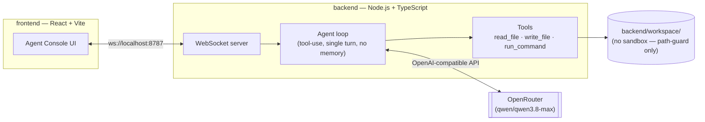
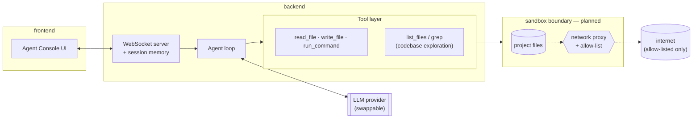

# kmc-code

**A minimal, from-scratch coding agent** — the kind of tool Claude Code or
Codex are, built to learn how agentic dev tools actually work under the
hood, one deliberate step at a time.

This is a personal learning project, not a product. It intentionally
starts small (see [Design Philosophy](#design-philosophy)) and grows only
as far as real usage justifies.

> **Security status: v0, no sandbox.** The agent can read/write files and
> run shell commands inside `backend/workspace/` only, guarded by a
> best-effort path check — not a real security boundary. Full threat
> model, capabilities, and worst-case scenarios are documented in
> [`spec.md`](./spec.md). Do not point this at anything you don't fully
> trust.

## What it does today

- Chat with an LLM agent over a WebSocket connection
- The agent can call three tools: `read_file`, `write_file`, `run_command`
- All tool calls are scoped to a single workspace directory
- LLM calls go through an OpenAI-compatible client to
  [OpenRouter](https://openrouter.ai), defaulting to `qwen/qwen3.8-max` —
  swappable via one environment variable, not locked to a single provider
- A terminal-style console UI streams every event (`tool_call`,
  `tool_result`, `tool_error`, ...) in real time

## Current architecture



Each user message starts a fresh agent loop — there is no conversation
memory between turns yet, and the agent has no way to explore the project
beyond a file path you give it directly.

## Tech stack

| Layer | Choice | Why |
|---|---|---|
| Frontend | React 19, TypeScript, Vite, Tailwind CSS v4, Radix primitives | Author's existing frontend expertise; state library (Redux Toolkit vs. Zustand vs. plain hooks) deliberately undecided until real usage informs it |
| Backend | Node.js, TypeScript | Same language across the stack while learning agent/backend architecture; a move to Rust for the sandbox/exec layer is a deliberate future step, not a starting point |
| LLM access | OpenAI SDK against OpenRouter | Provider-agnostic by design — swapping models or providers is a config change, not a rewrite |
| Transport | Raw WebSocket (`ws`) | Agent output needs to stream both ways (interruptible), which a plain request/response API doesn't fit well |

## Getting started

```bash
# Backend
cd backend
cp .env.example .env   # fill in OPENROUTER_API_KEY
npm install
npm run dev             # ws://localhost:8787

# Frontend (separate terminal)
cd frontend
npm install
npm run dev              # http://localhost:5173
```

## Roadmap / target architecture

The next steps under consideration, roughly in priority order:

1. **Conversation memory** — persist message history per session instead
   of starting fresh on every turn
2. **Codebase exploration tools** — `list_files` / a minimal `glob`, so the
   agent can look around a project instead of only reading paths it's
   told about
3. **A real sandbox boundary** — process/filesystem isolation plus a
   network allow-list, replacing the current best-effort path-guard
   (see `spec.md` §7 for the open questions this still has to answer)



This is the direction, not a commitment to a specific timeline or
implementation — see [`spec.md`](./spec.md) for the actual trust-boundary
reasoning behind it, and [`CLAUDE.md`](./CLAUDE.md) for where the project
currently stands.

## Design philosophy

Two references shape the decisions here:

- **Spec-first for anything security-critical** — trust boundaries and
  sandboxing decisions get written down and reasoned through before any
  code is written, not bolted on after.
- **Minimalism for everything else** — the tool itself stays as small as
  possible and grows only from real usage, rather than being designed
  upfront for hypothetical future needs.

Full reasoning, including the two projects that inspired this split, is
in [`CLAUDE.md`](./CLAUDE.md).

## Project structure

```
.
├── frontend/     React + Vite console UI
├── backend/      Node.js WebSocket server + agent loop
├── spec.md       Security/trust architecture spec
└── CLAUDE.md     Project memory — decisions, rationale, current state
```

---

Personal project, developed independently and on my own time — not
affiliated with any employer.
