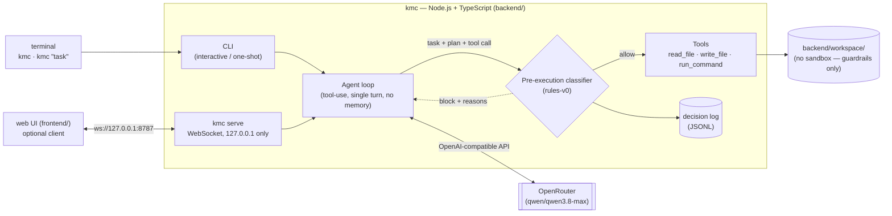
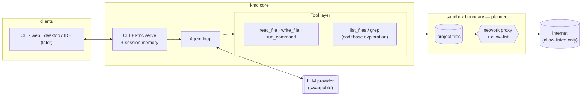

# kmc-code

**A minimal, from-scratch coding agent** — the kind of tool Claude Code or
Codex are, built to learn how agentic dev tools actually work under the
hood, one deliberate step at a time.

This is a personal learning project, not a product. It intentionally
starts small (see [Design Philosophy](#design-philosophy)) and grows only
as far as real usage justifies.

> **Security status: v0, no sandbox.** Every tool call passes a
> rule-based pre-execution classifier that blocks anything leaving
> `backend/workspace/`, anything irreversible, privilege escalation and
> network access. That is a guardrail, not a security boundary: it sees
> the command line, not what programs do. Full threat model and the
> classifier's known limitations are in [`spec.md`](./spec.md). Do not
> point this at anything you don't fully trust.

## What it does today

- **CLI first:** `kmc` in a terminal. Chat interactively, or run a single
  task with `kmc "fix the failing test"`
- **`kmc serve`** exposes the same agent over a local WebSocket, so other
  interfaces sit on top of the CLI instead of replacing it. The web UI in
  `frontend/` is the first such client; desktop or IDE clients would
  follow the same path
- The agent can call three tools: `read_file`, `write_file`, `run_command`
- All tool calls are scoped to a single workspace directory
- **Pre-execution classifier** — inspired by TypeSafe AI's
  [Jev](https://www.firecrawl.dev/blog/what-is-jev): before any tool
  runs, it answers four questions (irreversible? off-task? mutates?
  what scope?) and blocks the call if needed. Level 0 is plain rules;
  the interface is designed so a small LLM judge or a fine-tuned model
  can replace it later ([`spec.md` §8](./spec.md#8-pre-execution-action-classifier))
- Every classifier decision is logged as JSONL — the future training set
  for that fine-tuned model
- LLM calls go through an OpenAI-compatible client to
  [OpenRouter](https://openrouter.ai), defaulting to `qwen/qwen3.8-max` —
  swappable via one environment variable, not locked to a single provider
- Every event (`tool_call`, `tool_blocked`, `tool_result`, ...) streams
  in real time, both in the terminal and to `kmc serve` clients

## Current architecture



The agent loop is the core; the CLI and `kmc serve` are two thin ways
into it. This is the same shape Claude Code and Codex use: one core that
runs in a terminal, plus a server mode that other interfaces connect to.

Each user message starts a fresh agent loop — there is no conversation
memory between turns yet (even inside one interactive session), and the
agent has no way to explore the project beyond a file path you give it
directly.

## Tech stack

| Layer | Choice | Why |
|---|---|---|
| Primary interface | CLI (`kmc`), no framework — Node's `readline` and `util.styleText` | The CLI is the skeleton; other interfaces are clients of `kmc serve`, so they don't each re-implement the agent |
| Core | Node.js, TypeScript | Same language across the stack while learning agent architecture; a move to Rust for the sandbox/exec layer is a deliberate future step, not a starting point |
| LLM access | OpenAI SDK against OpenRouter | Provider-agnostic by design — swapping models or providers is a config change, not a rewrite |
| Client protocol | WebSocket (`ws`), loopback only, `kmc serve` | Agent output streams both ways (interruptible), which plain request/response doesn't fit well |
| Web client | React 19, TypeScript, Vite, Tailwind CSS v4, Radix primitives | Author's existing frontend expertise; optional, not required to use the agent |

## Getting started

```bash
cd backend
cp .env.example .env    # fill in OPENROUTER_API_KEY
npm install
npm run build
npm link                # installs the `kmc` command

kmc                      # interactive session
kmc "list the files"     # one task, then exit
kmc --workspace ../my-app   # work somewhere else — no sandbox, your call
kmc --help
```

`kmc` works from any directory: `.env`, the default workspace
(`backend/workspace/`) and the decision log are always resolved from
`backend/`, never from where you run it.

Optional web client:

```bash
kmc serve                # ws://127.0.0.1:8787 — in one terminal
cd frontend && npm install && npm run dev   # http://localhost:5173 — in another
```

Development: `npm run dev` (CLI without building), `npm run serve`
(server with reload), `npm test` (classifier, CLI and rendering tests).

## Roadmap / target architecture

The next steps under consideration, roughly in priority order:

1. **Conversation memory** — persist message history per session instead
   of starting fresh on every turn
2. **Codebase exploration tools** — `list_files` / a minimal `glob`, so the
   agent can look around a project instead of only reading paths it's
   told about
3. **A real sandbox boundary** — process/filesystem isolation plus a
   network allow-list, replacing the current best-effort path-guard
   (see `spec.md` §7 for the open questions this still has to answer)



This is the direction, not a commitment to a specific timeline or
implementation — see [`spec.md`](./spec.md) for the actual trust-boundary
reasoning behind it, and [`CLAUDE.md`](./CLAUDE.md) for where the project
currently stands.

## Design philosophy

Two references shape the decisions here:

- **Spec-first for anything security-critical** — trust boundaries and
  sandboxing decisions get written down and reasoned through before any
  code is written, not bolted on after.
- **Minimalism for everything else** — the tool itself stays as small as
  possible and grows only from real usage, rather than being designed
  upfront for hypothetical future needs.

Full reasoning, including the two projects that inspired this split, is
in [`CLAUDE.md`](./CLAUDE.md).

## Project structure

```
.
├── backend/      the kmc CLI: agent loop, classifier, `kmc serve`
├── frontend/     optional web client for `kmc serve` (React + Vite)
├── spec.md       Security/trust architecture spec
└── CLAUDE.md     Project memory — decisions, rationale, current state
```

---

Personal project, developed independently and on my own time — not
affiliated with any employer.
